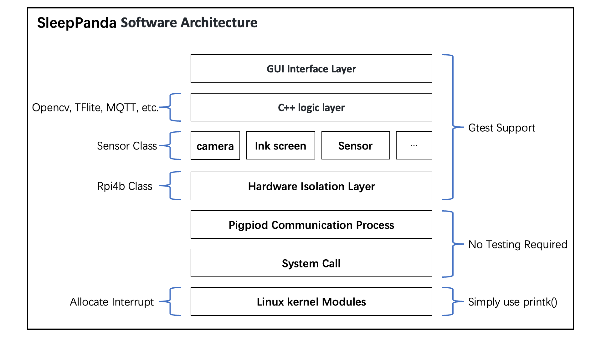

<!--
 * @Author: Chengsen Dong 1034029664@qq.com
 * @Date: 2023-01-18 00:44:11
<<<<<<< HEAD
 * @LastEditors: Chengsen Dong 1034029664@qq.com
 * @LastEditTime: 2023-03-09 17:39:12
=======
 * @LastEditors: Chengsen Dong 1034029664@qq.com
 * @LastEditTime: 2023-02-15 16:27:55
>>>>>>> 249ff8955d897cad0304e78fe3cb63d7f345510c
 * @FilePath: /SleepPanda/README.md
 * @Description: 
 * Copyright (c) 2023 by Chengsen Dong 1034029664@qq.com(www.github.com/xddcore), All Rights Reserved. 
-->
# SleepPanda, a caring sleep manager


[](https://github.com/ellerbrock/open-source-badges/ )


>[Click me to visit the Youtube channel](https://www.youtube.com/@SleepPanda666)


Change README Language: [English](./README.md) ｜ [Chinese](./README_ZH.md)

## Auto Unit Test
| Source | Status |
| ---- | ---- |
| helloworld.cpp |  |
| rpi4b-qemu-env |  |
| . | . |
| . | . |


## Project Description
SleepPanda is a sleep monitoring system based on Raspberry Pi 4b (bcm2711). SleepPanda uses a variety of sensors to collect sleep data of users, and analyzes and processes the data through dsp, convolutional neural network and other algorithms. Finally, the data processing results are presented to users in various ways.

## Project Features
1. Early bed reminder, wake up alarm clock
2. Body temperature (thermal imaging), heart rate, blood oxygen monitoring
3. Sleep position monitoring
4. Early warning of apnea syndrome
5. Light/deep sleep classification
6. Playing sleep aid music
7. Sharing and social networking (different SleepPanda hardware will be connected to the same server, which will help users share sleep data and monitor each other's early bedtime plans)

## Project Contributors
| Name | ID | Role |
| ---- | ---- | ---- |
| Chengsen Dong | 2789825d | Embedded Engineer |
| Rui Liu | 2756138L | Project Management & Publicity & Software Engineer |
| Hui Wang | 2810919W | Hardware Engineer & Test Engineer |
| Yihan Wang | 2696441W | Project Management & Publicity & Software Engineer |
> If you have any suggestions for this project, please email to xddcore@gmail.com

## Project Development Planning

>[Click here to view the minutes of the development meeting](./doc/meeting/)  
>[Click me to visit the Gantt chart](./doc/project%20management/)

#### Global
- [x] Build the Github warehouse & README document, complete the basic development environment configuration, fix the Linux kernel source code, and test the compilation of the kernel module.
- [x] build dev branch
- [x] Buy all hardware (except touchscreen)
- [x] Pitch Session PPT slide draft
- [x] Final draft of Pitch Session PPT slides
- [x] 14:20:00, 25/01/2023 Pitch Session

#### Chengsen Dong
- [ ] Update the README document (synchronized with the development process)
- [x] Buzzer driver development
- [x] MAX30101 driver development
- [x] 4K 30FPS camera (opencv c++ framework)
- [ ] Touch screen (QT-based GUI) development & top-level C++ logic
- [ ] MQTT server setup (low priority)
- [ ] Check memory management and memory leaks (using STL to manage memory)

#### Yihan Wang
- [ ] Synchronously update the contents of README_ZH.md & README.md (once a week)
- [ ] Simultaneous updates of the minutesmeeting (once a week)
- [x] Creation of a Youtube channel to promote the SleepPanda project
- [x] Pitch Session PPT slide draft
- [x] Make cost accounting & original row selection Excel table
- [x] Sound Sensor Driver Development
- [x] WM8960 driver development (low priority)
- [ ] To do later...

#### Rui Liu
- [ ] Synchronously update the contents of README_ZH.md & README.md (once a week)
- [ ] Simultaneous updates of the minutesmeeting (once a week)
- [ ] Create Gantt charts to organise tasks according to the classification of people
- [x] Design SleepPanda Logo
- [x] Pitch Session PPT slide final draft & pitch session speech preparation
- [x] Make cost accounting & original row selection Excel table
- [ ] ink screen driver development (virtual zoo)
- [ ] To do later...

#### Hui Wang
- [x] Query the data sheets of all sensors/chips and upload them to the github repository
- [ ] MLX90640 driver development
- [ ] To do later...

# guide

## 1. System deployment

### 1.1 Software and hardware version

0. **C++11 Standard Template Library**
1. Raspberry Pi 4B (4GB/8GB)｜bcm2711
2. Linux distribution: Ubuntu Desktop 22.04.01 LTS (64Bit)
3. Kernel version: 5.15.0-1023-raspi | Retrieve all Linux kernel `apt-cache search linux-raspi-headers`
4. g++: `g++ (Ubuntu 11.3.0-1ubuntu1~22.04) 11.3.0`
5. gcc: `gcc (Ubuntu 11.3.0-1ubuntu1~22.04) 11.3.0`
6. Unit Test Framework: Google Test + ctest

### 1.2 Separate Raspberry Pi from keyboard, mouse & monitor
0. Software that needs to be installed on a Windows computer: `1.Termius (for SSH)` `2.Microsoft Remote Desktop (for remote desktop) 3.Visual Studio code (universal editor)`
1. Use Raspberry Pi Image to burn the image to SD card (ubuntu image: `https://ubuntu.com/raspberry-pi/desktop`)
2. Use an external monitor, keyboard and mouse to complete the initialization of ubuntu. The system language is English, the created user name is `ubuntu`, and the password is `ubuntu`.
3. Packages to be installed: ssh vim gcc g++ screen htop git make
```
sudo apt-get update
sudo apt-get upgrade
sudo apt-get install ssh vim gcc g++ screen htop git make
```
>Note: Note that the `sudo apt-get upgrade` command will upgrade the kernel to the latest version by default, please manually keep the kernel version to 5.15.0-1023-raspi
4. Open ubuntu remote desktop: Setting-share-open remote desktop-change username and password to `ubuntu`

    4.1 Allow hdmi hot plugging to avoid inability to access remote desktop when hdmi is not plugged in. | `Unresolved! ! ! `|Try to use HDMI dummy load to resolve
    Enter the following command: `sudo vim /boot/firmware/config.txt`, and add the following content to the config.txt file:
    ```
    [hdmi]
    #allow remote desktop when no hdmi wire
    hdmi_force_hotplug=1
    hdmi_drive=2
    ```
    4.2 Fix the remote desktop login password to prevent the password from being randomly generated after each restart and unable to access the remote desktop
    Application-password&keys-default key&login-change password-do not set a password (leave blank)-finally cancel encryption
    4.3 Use the Microsoft Remote Desktop software to access the Raspberry Pi desktop | Raspberry Pi's LAN IP + user name and password are `ubuntu`
    >How to get Raspberry Pi IP: 1. If it is under the same router, it can be obtained by accessing the background of the router. 2. If you cannot access the router backend, obtain the Raspberry Pi’s LAN IP through `arp -a(windows)` and other methods.

5. Prevent Raspberry Pi from sleeping: Setting-Power-Nerver sleep
6. At this point, the Raspberry Pi is completely separated from the keyboard, mouse and monitor, and can be operated remotely by other computers
7. Use Termius software to SSH to connect to the LAN IP of the Raspberry Pi. Username: `ubuntu` Password: `ubuntu`

### 1.3 Take the Raspberry Pi off the keypad & monitor (For Raspberry Pi OS)

0. Software to be installed on your Windows PC: `1.Termius (for SSH)` `2.VNC Viewer (for remote desktop, download link https://www.realvnc.com/en/connect/download/viewer/)` `3.Visual Studio code (Universal Editor)` `Raspberry Pi Image (image burning) ` `5.Github Desktop(Optional)`
1. Burn the `Raspberry Pi OS(32bit)` image to the SD card using Raspberry Pi Image (Raspberry Pi OS image:`https://www.raspberrypi.com/software/operating-systems/`)
>Before burning, click on the gear button in the bottom right hand corner to configure the following:
> 1. check Set hostname -> raspberrypi.local
> 2. check Enable SSH service -> Login with password
> 3. Check Set username and password -> Username: pi | Password: pi
> 4. Click Save
2. Connect the Raspberry Pi to the power supply and start the Raspberry Pi. Wait for a while and then connect to the Raspberry Pi via SSH with `termius` software. 
3. Enter the `sudo raspi-config` command and use the **direction keys** to configure the following:
> 1. Set the boot option to automatically log into the desktop. `System Options -> Boot/Auto Login -> Desktop Autologin`
> 2. Open VNC Remote Desktop. `Interface Options -> VNC -> YES` 
> 3. Open the SPI port. ` Interface Options -> SPI -> YES` 
> 4. Open the IIC port. `Interface Options -> I2C -> YES` 
> 5. Select Finish to save the settings. 
4. Enter the `reboot` command to reboot the Raspberry Pi. (Wait a while after performing this step) 
5. At this point, the Raspberry Pi is ready to be accessed via `VNC Viewer` remote desktop.
>The corresponding VNC package on the Raspberry Pi is `realvnc-vnc-server` (Raspberry Pi OS comes with it, no need to install it)
6. packages to be installed: ssh vim gcc g++ screen htop git make, execute the following command:
```
sudo apt-get update
sudo apt-get upgrade
sudo apt-get install ssh vim gcc g++ screen htop git make
```
4. Enter the `reboot` command to reboot the Raspberry Pi. At this point, the basic environment configuration is complete.

### 1.4 Build cross-compilation environment & local compilation environment
Considering that the computing power of the Raspberry Pi is insufficient, using a server will significantly improve compilation efficiency, version control, code backup, and collaborative work. We use a centralized server (`I9-12900k+RTX3090TI+32GB DDR4+512G SSD`) during the development of this project, and build a cross-compilation environment in the server.

#### 1.4.1 Cross-compilation environment (server)

1. Install the aarch64-linux-gnu-cross-compilation toolchain, and other compilation tools required to compile the linux kernel
2. Get the Raspberry Pi kernel source code
```
apt-get source linux-image-$(uname -r) #5.15.0-1023-raspi
```
3. Compile the kernel source code
>Ref: https://www.raspberrypi.com/documentation/computers/linux_kernel.html
4. Compile `helloworld` module code
5. Test the `helloworld` module


#### 1.4.2 Local compilation environment (Raspberry Pi)

1. Compile `helloworld` module code

```
make -C /usr/src/linux-headers-5.15.0-1023-raspi/ M=`pwd` modules
```
2. Test the `helloworld` module
>Test result same as above

---

Q1: The module is not signed problem:
It looks like your system vendor has enabled kernel module signature verification on your kernel, which means it won't load any modules that the vendor hasn't signed. In other words, your patched module is not (correctly) signed and the kernel will refuse to load it.
> Solution: cmd run `CONFIG_MODULE_SIG=n`

Q2: When `sudo apt-get upgrade` is executed, some packs (such as the linux kernel) are reserved and cannot be upgraded.
> `sudo apt-get --with-new-pkgs upgrade`


### 1.5 Sensors & Actuators & Servers

>[Click me to download BOM](./doc/BOM/SleepPanda_BOM.xlsx)

>[Click me to download datasheet](./doc/datasheet/)

**sensor**
1. Speaker & Microphone: WM8960(Control:IIC;Audio:IIS)+Sound Sensor(Voltage Comparator Dout)-✅
2. Body temperature (thermal imaging) & gesture control: MLX90640(IIC)-✅
3. Heart rate & blood oxygen: MAX30101(IIC)-✅
4. Sleeping position monitoring: 4K 30FPS camera (USB+OpenCV)-✅

**Actuator**
1. Ink Screen:SSD1608(Virtual Zoo) (SPI)-✅
2. Touch screen (QT-based GUI) (Video: HDMI, Touch: USB)
3. Buzzer: Emergency abnormal alarm (High/Low Pin Level)-✅

**other**

1. Several DuPont lines-✅


**server**
Facing the world, it is responsible for storing user data and undertaking visits/animal exchanges between virtual zoos.


## 2. System development

### 2.1 Get the source code of SleepPanda

`git clone https://github.com/xddcore/SleepPanda.git`

**Note: If you are a developer, remember to switch to the dev branch with the following command:**
```
git checkout dev
git branch -l
```

### 2.2 cpp unit testing framework

#### 2.2.1 cppunit

```
#install cppunit-lib
sudo apt install -y libcppunit-dev
```
>#include <cppunit/TestRunner.h>

> because:
>1. Google test is relatively simple to use. Writing a test case does not need to be divided into two parts: declaration and definition, and there is no need to register the test suite yourself.
>2. The assert of google test is richer
> So this project uses google test (gtest) for unit testing

#### 2.2.2 google test(gtest)
##### 2.2.2.1 Directly load the compiled dynamic link library file

###### 2.2.2.1.1 For Ubuntu Desktop 22.04 64bit

gtest dynamic link library path `SleepPanda/tools/gtest/lib/`, gtest header file path `SleepPanda/tools/gtest/include/`

```
# g++ build demo

# cd to workscape
cd /SleepPanda/src/app/gtest_demo

# build code
g++ -std=c++14 ./gtest_demo.cpp -I ../../../tools/gtest/include/ ../../../tools/gtest/lib/libgtest.so -lpthread -o gtest_demo

# Export the gtest dynamic link library to the system environment variable (temporary)
export LD_LIBRARY_PATH=../../../tools/gtest/lib/:$LD_LIBRARY_PATH

# run gtest demo
./gtest_demo
```

###### 2.2.2.1.2 For Raspberry Pi OS 32bit**

gtest dynamic link library path`SleepPanda/tools/gtest/rpios_32bit/lib/`
gtest header file path`SleepPanda/tools/gtest/rpios_32bit/include/`

* Compile using g++ (choose one of the two compilation methods, or try both)
```
# g++ build demo

# cd to workscape
cd ./SleepPanda/src/app/gtest_demo

# build code
g++ -std=c++14 ./gtest_demo.cpp -I ../../../tools/gtest/rpios_32bit/include/ ../../../tools/gtest/rpios_32bit/lib/libgtest.so -lpthread -o gtest_demo

# Export the gtest dynamic link library to the system environment variable (temporary)
export LD_LIBRARY_PATH=../../../tools/gtest/rpios_32bit/lib/:$LD_LIBRARY_PATH

# run gtest demo
./gtest_demo
```

* Compile with cmake (choose one of the two compilation methods, or try both)
```
# g++ build demo

# cd to workscape
cd ./SleepPanda/src/app/gtest_demo/build

# build code
cmake .. && make

# Export the gtest dynamic link library to the system environment variable (temporary)
export LD_LIBRARY_PATH=../../../tools/gtest/rpios_32bit/lib/:$LD_LIBRARY_PATH

# run gtest demo
./gtest_demo
```
**Error: When compiling with cmake, the following error may occur:**
```
CMake Error: The source "/home/pi/xddcore/SleepPanda/src/app/gtest_demo/CMakeLists.txt" does not match the source "/home/ubuntu/xddcore/SleepPanda/src/app/gtest_demo/CMakeLists.txt" used to generate cache.  Re-run cmake with a different source directory.
```
**Solution:**
```
# remove /build dir
rm -rf build/

# create new /build dir
mkdir build

# go to build dir
cd build

# build code
cmake .. && make

# run gtest demo code
cd .. && ./gtest_demo

```

Theoretically, you will get the following running result:
```
./gtest_demo
[==========] Running 2 tests from 1 test suite.
[----------] Global test environment set-up.
[----------] 2 tests from FooTest
[ RUN      ] FooTest.test_add
[       OK ] FooTest.test_add (0 ms)
[ RUN      ] FooTest.test_minus
./gtest_demo.cpp:54: Failure
Expected equality of these values:
  foo->GetNum()
    Which is: 1
  0
[  FAILED  ] FooTest.test_minus (0 ms)
[----------] 2 tests from FooTest (1 ms total)

[----------] Global test environment tear-down
[==========] 2 tests from 1 test suite ran. (2 ms total)
[  PASSED  ] 1 test.
[  FAILED  ] 1 test, listed below:
[  FAILED  ] FooTest.test_minus
```

##### 2.2.2.2 Compile the dynamic link library file by yourself through the google test source code
```
# install dependencies
sudo apt-get install cmake

# install google test lib

# get source
git clone https://github.com/google/googletest.git

#build
cd googletest
mkdir build
cd build
cmake -DCMAKE_INSTALL_PREFIX=`pwd`/install -DBUILD_SHARED_LIBS=ON ..
make -j8
make install

# Then the corresponding dynamic library of gtest will be generated in the build/install directory
ls install /
# include lib

```

### 2.3 Hardware Architecture


>Ref:https://abyz.me.uk/rpi/pigpio/index.html

> If you want to query GPIO more quickly, you can visit the following URL: https://pinout.xyz/pinout/


### 2.4 Software Architecture

 

|Index| Layer|-|Comments|
|:----:|:----:|:----:|:----:|
|7(Top)|GUI Interface Layer(QT)|-|Interaction with users|
|6|C++ Logic Layer|-|Opencv, TensorFlow Lite, MQTT Client, etc.|
|5|Hardware Driver Layer (Sensor Class)|-|Configuration/Driver of Hardware (Sensor, etc.)|
|~~4~~|~~Hardware Isolation Layer (Rpi4b Class)~~|-|~~Isolate software logic and hardware dependencies, the purpose is to run/test the upper layer code independently of the underlying hardware dependencies (such as pigpio).~~|
|3|Pigpiod Nested Word Communication Process|-|Drive rpi4b(bcm2711) register|
|2|System Call|-|Provided by the linux kernel|
|1(Bottom)|Linux Kernel Modules|-|Allocate interrupt|

### 2.5 Sensor & Actuator Driver Development

>Ref:
> https://berndporr.github.io/realtime_cpp_coding/
> https://github.com/berndporr/realtime_cpp_coding

**Before you start**, you need to execute the following commands to install the necessary dependencies. Here, I would like to express my sincere thanks to the developers of the pigpio library (https://github.com/joan2937/pigpio).

**How to install Raspberry Pi OS**

Run the following command to install piopig with one click

```
sudo apt-get install libpigpio-dev
```

**Other operating system installation methods**

```
apt-get install cmake
# Download and install latest version(pigpio)
wget https://github.com/joan2937/pigpio/archive/master.zip
unzip master.zip
cd pigpio-master
make
sudo make install

#If the Python part of the install fails it may be because you need the setup tools.
sudo apt install python-setuptools python3-setuptools
```

Finally, in order to verify whether pigpio lib is installed correctly, we also **recommend you to run the following test command**:
```
cd pigpio-master #(if you are not in this dir)
sudo ./x_pigpio # check C I/F

# To start the pigpio daemon
sudo pigpiod
./x_pigpiod_if2 # check C I/F to daemon
# Then you should get PASS

# To stop the pigpio daemon
sudo killall pigpiod
./x_pigpiod_if2 # check C I/F to daemon
# Then you should get 'pigpio initialisation failed (-2003).', because pigpio daemon not running.
```
>Note: Every time you use pigpio, you should first run `sudo pigpiod` to start the daemon.

Theoretically, you will get the following running result:
```
Testing pigpio C I/F
pigpio version 79.
Hardware revision 13644052.
Mode/PUD/read/write tests.
TEST  1.1  PASS (set mode, get mode: 0)
TEST  1.2  PASS (set pull up down, read: 1)
TEST  1.3  PASS (set pull up down, read: 0)
TEST  1.4  PASS (write, get mode: 1)
TEST  1.5  PASS (read: 0)
TEST  1.6  PASS (write, read: 1)
PWM dutycycle/range/frequency tests.
TEST  2.1  PASS (set PWM range, set/get PWM frequency: 10)
TEST  2.2  PASS (get PWM dutycycle: 0)
TEST  2.3  PASS (set PWM dutycycle, callback: 0)
TEST  2.4  PASS (get PWM dutycycle: 12

...etc
```

---
Q1: ERROR: **initAllocDMAMem: mbox open failed(No such device or address)**
```
:~$ sudo pigpiod
OR
:~$ ./x_pigpio
then get
:~$ initAllocDMAMem: mbox open failed(No such device or address)
```
Fixup: Run `sudo modprobe vcio`
OR
`./x_pigpio` is a program that uses mailboxes to allocate memory. If under certain conditions (e.g. qemu env), you won't have GPU memory to allocate. pigpio will use the mailbox to allocate DMA memory (unless you request a large buffer). When pigpiod is started with the `-a1` option, page mapping is used to allocate DMA memory.
```
sudo pigpiod -a1 #force use PMAP allocate DMA memory
./x_pigpiod_if2 # check C I/F to daemon
```

Q2: ERROR: **modprobe: FATAL: Module vcio not found in directory**
```
:~$ sudo modprobe vcio
:~$ modprobe: FATAL: Module vcio not found in directory /lib/modules/5.15.0-1031-azure
```
Fixup: Run `sudo apt-get install -y linux-modules-extra-$(uname -r)`
OR
`You need install Ubuntu Desktop Image, and then you will have vcio(videocore io)`

Q3: ERROR: **initInitialise: Can't lock /var/run/pigpio.pid**
```
:~$ sudo ./x_pigpio
:~$ initInitialise: Can't lock /var/run/pigpio.pid
pigpio initialisation failed.
```
Fixup: Run `sudo killall pigpiod`

Q4: In the QEMU environment, pigpio cannot be emulated
```
2023-01-27 09:02:23 initAllocDMAMem: mbox open failed(No such device or address)
Can't initialize pigpio library
pigpio initialisation failed (-2003).
```
Fixup: Because pigpio relies on the BCM2711 chip hardware function to achieve ultra-low-latency DMA operations, and qemu's DMA cannot support this operation, so pigpio simulation cannot be completed in the QEMU environment.

#### 2.5.1 Buzzer
>Author: Chengsen Dong

**Features:**   
The module is driven by S8550 transistor.   
Working voltage 3.3V-5V.    
Low level trigger.   
Designed with holes for fixing with bolt, so it is easy to assemble.    
VCC: External 3.3V-5V voltage (can be directly connected with 5V single-chip microcomputer and 3.3V single-chip microcomputer)    
GND: External GND   
I/O: External micro-controller IO port   

**Unit Test DEMO**

When the unit test program runs:
If you hear the buzzer, please use the keyboard to type "Y" and press ENTER.

Execute the following command to run unit tests:
```
## change to work dir
cd SleepPanda/src/app/Buzzer/build

# build, and run unit test(gtest)
cmake .. && make && sudo ctest --verbose
```

#### 2.5.2 Sound Sensor
>Author: Yihan Wang

**Specification:**
Working Voltage: DC 3.3V-5.5V  
Nominal Frequency: 40KHz  
PCB Size: 35 x 15mm / 1.38 x 0.59" (LxW)  
Fixed Hole Diameter: 3mm  
Main chip:LM393, Electret condenser microphone  
Output form: Digital and Analog Output  

**Note:**
AO outputs real-time voltage signal of the microphone.  
DO outputs low and high lever signal when the sound intensity reaches a threshold  
Sensitivity is adjustable by adjusting the potentiometer 

**Unit Test DEMO**

What you will see: Make a sound, the DO pin level of the sound sensor will jump from low level to high level (rising edge interrupt), trigger a sound event, and the screen will print `Rpi_SoundSensor Class DEBUG: SoundSensor_SoundEvent_Handle() was triggered .`. 

When the unit test program runs:
Make a sound and press ENTER on your keyboard.

Execute the following command to run unit tests:
```
## change to work dir
cd SleepPanda/src/app/SoundSensor/build

# build, and run unit test(gtest)
cmake .. && make && sudo ctest --verbose
```

#### 2.5.3 MAX30101
>Author:Chengsen Dong

>Ref:
>1. https://github.com/pimoroni/max30105-python
>2. https://shop.pimoroni.com/products/max30101-breakout-heart-rate-oximeter-smoke-sensor?variant=21482065985619

>Note: Through the `raspi-gpio get` query, it is found that the Interrupt Pin -4 originally planned to be used is occupied by other programs, resulting in the input level being always 0, and the external interrupt function cannot be realized. So will use GPIO6 to connect to INT pin of MAX30101.

**Unit Test DEMO**

Execute the following command to run unit tests:
```
## change to work dir
cd SleepPanda/src/app/MAX30101/build

# build, and run unit test(gtest)
cmake .. && make && sudo ctest --verbose
```

What you'll see: Put your fingertip on the MAX30101 sensor, wait 15 seconds, and press the Enter key on your keyboard. Unit testing is complete. The program will output the current heart rate and blood oxygen values. You will get output similar to:
```
1: Rpi_MAX30101 Class DEBUG: MAX30101_DataReadyEvent_Handle() was triggered.|heart_rate: 71, spo2: 99.525826
1: ir_mean: 136982.530000, red_mean: 121904.060000
1: beta_ir: -4.232085, beta_red: -2.549403
1: n_last_peak_interval test = GOOD
1: boundary test = GOOD
1: Rpi_MAX30101 Class DEBUG: MAX30101_DataReadyEvent_Handle() was triggered.|heart_rate: 78, spo2: 99.414008
1: ir_mean: 136578.920000, red_mean: 121704.060000
1: beta_ir: 4.154383, beta_red: 0.232127
1: n_last_peak_interval test = GOOD
1: boundary test = GOOD
1: Rpi_MAX30101 Class DEBUG: MAX30101_DataReadyEvent_Handle() was triggered.|heart_rate: 83, spo2: 99.427597
1: ir_mean: 137294.050000, red_mean: 121818.950000
1: beta_ir: 8.709769, beta_red: 1.685311
1: n_last_peak_interval test = GOOD
1: boundary test = GOOD
1: Rpi_MAX30101 Class DEBUG: MAX30101_DataReadyEvent_Handle() was triggered.|heart_rate: 75, spo2: 99.445994
1: Rpi_MAX30101.ISR_CheckPoint: 1
1: RPI DEBUG: MAX30101 Delete.
1: [ OK ] MAX30101_Test.Check_MAX30101_ISR_HeartRate_SPO2 (45287 ms)
1: [----------] 1 test from MAX30101_Test (45287 ms total)
1: 
1: [----------] Global test environment tear-down
1: [==========] 1 test from 1 test suite ran. (45287 ms total)
1: [ PASSED ] 1 test.
1/1 Test #1: MAX30101_Test ................... Passed 45.30 sec

100% tests passed, 0 tests failed out of 1

Total Test time (real) = 45.30 sec
```

#### 2.5.4 WM8960
>Author:Yihan Wang

>Ref:
>1. https://wiki.seeedstudio.com/ReSpeaker_2_Mics_Pi_HAT/
>2. https://shop.pimoroni.com/products/respeaker-2-mics-phat?variant=49979573706

After using the arecord command that comes with the system, the system Log is as follows:
Apparently, the sound card driver is not supported.
```
sudo arecord -D hw:3,0 -d 2 -f cd -c 2 -v -t wav test.wav

Recording WAVE 'test.wav' : Signed 16 bit Little Endian, Rate 44100 Hz, Stereo
arecord: set_params:1407: Unable to install hw params:
ACCESS: RW_INTERLEAVED
FORMAT: S16_LE
SUBFORMAT: STD
SAMPLE_BITS: 16
FRAME_BITS: 32
CHANNELS: 2
RATE: 44100
PERIOD_TIME: (125011 125012)
PERIOD_SIZE: 5513
PERIOD_BYTES: 22052
PERIODS: 4
BUFFER_TIME: (500045 500046)
BUFFER_SIZE: 22052
BUFFER_BYTES: 88208
TICK_TIME: 0
```
solution:
> 1. https://github.com/respeaker/seeed-voicecard/pull/323
> 2. https://github.com/respeaker/seeed-voicecard/issues/326
> 3. https://github.com/HinTak/seeed-voicecard

Execute the following command (using an unofficial fork to fix bugs):
```
git clone https://github.com/HinTak/seeed-voicecard.git
cd seen-voicecard
sudo ./install.sh
sudo reboot now
```
---
**WM8960 device driver test**

Playback device:
```
aplay -l
**** List of PLAYBACK Hardware Devices ****
card 0: Headphones [bcm2835 Headphones], device 0: bcm2835 Headphones [bcm2835 Headphones]
   Subdevices: 8/8
   Subdevice #0: subdevice #0
   Subdevice #1: subdevice #1
   Subdevice #2: subdevice #2
   Subdevice #3: subdevice #3
   Subdevice #4: subdevice #4
   Subdevice #5: subdevice #5
   Subdevice #6: subdevice #6
   Subdevice #7: subdevice #7
card 1: vc4hdmi0 [vc4-hdmi-0], device 0: MAI PCM i2s-hifi-0 [MAI PCM i2s-hifi-0]
   Subdevices: 1/1
   Subdevice #0: subdevice #0
card 2: vc4hdmi1 [vc4-hdmi-1], device 0: MAI PCM i2s-hifi-0 [MAI PCM i2s-hifi-0]
   Subdevices: 1/1
   Subdevice #0: subdevice #0
card 3: seeed2micvoicec [seeed-2mic-voicecard], device 0: bcm2835-i2s-wm8960-hifi wm8960-hifi-0 [bcm2835-i2s-wm8960-hifi wm8960-hifi-0]
   Subdevices: 1/1
   Subdevice #0: subdevice #0
```

Recording equipment:
```
arecord -l
**** List of CAPTURE Hardware Devices ****
card 3: seeed2micvoicec [seeed-2mic-voicecard], device 0: bcm2835-i2s-wm8960-hifi wm8960-hifi-0 [bcm2835-i2s-wm8960-hifi wm8960-hifi-0]
   Subdevices: 1/1
   Subdevice #0: subdevice #0
```

**Recording command**:
```
arecord -D "plughw:3,0" -d 2 -f cd -c 2 -v -t wav test.wav
```
>-D specifies the recording device
-d set recording duration
-f recording sample format
-c specifies the channel
-t file type of recording output
path and name of test.wav output file

**Play command**:
```
aplay -D "plughw:3,0" test.wav
```

**Unit Test DEMO**

What you will see: WM8960 will record for 3 seconds and create a Record_Wav_File_Test.wav file.

When the unit test program runs:
Please make a sound/play a song.

Execute the following command to run unit tests:
```
## change to work dir
cd SleepPanda/src/app/WM8960/build

# build, and run unit test(gtest)
cmake .. && make && sudo ctest --verbose
```
>Note: If the Record_Wav_File_Test.wav file is successfully created, but there is no sound when it is opened and played, please use the `alsamixer` sound card management program to enable the microphone of the WM8960 sound card.

#### 2.5.5 Ink Screen(SSD1608)
>Author:Rui Liu

>Ref:
>1. https://github.com/pimoroni/inky
>2. https://shop.pimoroni.com/products/inky-phat?variant=12549254905939

#### 2.5.6 MLX90640
>Author:Hui Wang

>Ref:
>1. https://github.com/pimoroni/mlx90640-library
>2. https://shop.pimoroni.com/products/mlx90640-thermal-camera-breakout?variant=12536948654163

#### 2.5.7 USB Camera
>Author:Chengsen Dong