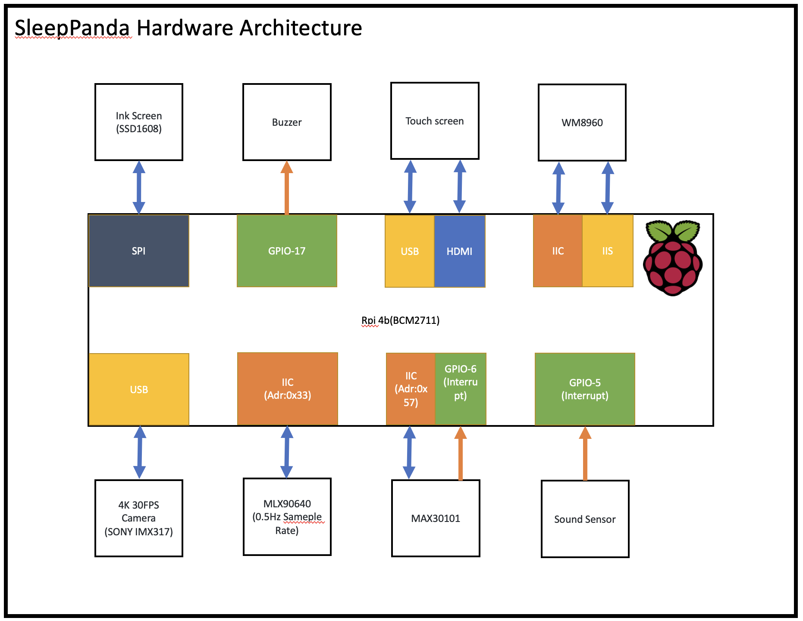

<!--
 * @Author: Chengsen Dong 1034029664@qq.com
 * @Date: 2023-01-15 20:09:22
<<<<<<< HEAD
 * @LastEditors: Chengsen Dong 1034029664@qq.com
 * @LastEditTime: 2023-03-05 20:58:16
=======
 * @LastEditors: Chengsen Dong 1034029664@qq.com
 * @LastEditTime: 2023-02-15 16:29:50
>>>>>>> 249ff8955d897cad0304e78fe3cb63d7f345510c
 * @FilePath: /SleepPanda/README_ZH.md
 * @Description: 
 * Copyright (c) 2023 by Chengsen Dong 1034029664@qq.com(www.github.com/xddcore), All Rights Reserved. 
-->
# SleepPanda，一个贴心睡眠管家

  

[](https://github.com/ellerbrock/open-source-badges/)  


>[点我访问Youtube频道](https://www.youtube.com/@SleepPanda666)


Change README Language: [English](./README.md) ｜ [中文](./README_ZH.md)

## Auto Unit Test
|  Source   | Status  |
|  ----  | ----  |
| helloworld.cpp  |  |
| rpi4b-qemu-env  |  |
| . | . |
| .  | . |


## 项目简介
SleepPanda是一个以树莓派4b(bcm2711)为核心的睡眠监测系统。SleepPanda使用多种传感器收集用户的睡眠数据，并通过dsp，卷积神经网络等算法对数据进行分析处理。最终将数据处理结果通过多种方式呈现给用户。

## 项目特性
1. 早睡提醒，起床闹钟
2. 体温(热成像)，心率，血氧监测
3. 睡姿监测
4. 呼吸暂停综合症预警
5. 浅度/深度睡眠分类
6. 助眠音乐播放
7. 分享与社交(不同的SleepPanda硬件将会被连接至同一服务器，这将有助于用户间分享睡眠数据，以及互相监督早睡计划)

## 项目贡献者
|  Name   | ID  |  Role  |
|  ----  | ----  | ----  |
| Chengsen Dong  | 2789825d | 嵌入式工程师 |
| Rui Liu  | 2756138L | 项目管理&宣传&软件工程师 |
| Hui Wang  | 2810919W | 硬件工程师&测试工程师 |
| Yihan Wang  | 2696441W | 项目管理&宣传&软件工程师 |
>如果你对本项目有任何建议，欢迎发邮件至xddcore@gmail.com

## 项目开发规划

>[点我查看开发会议纪要](./doc/meeting/)  
>[点我访问甘特图](./doc/project%20management/)

#### Global
- [x] 构建Github仓库&README文档，完成基础开发环境配置，固定Linux内核源码，测试内核模块编译。 
- [x] 建立dev分支
- [x] 购买所有硬件(除触摸屏以外)
- [x] Pitch Session PPT幻灯片初稿
- [x] Pitch Session PPT幻灯片最终稿
- [x] 14:20:00, 25/01/2023 Pitch Session

#### Chengsen Dong
- [ ] 更新README文档(随着开发过程同步更新)
- [x] 蜂鸣器驱动开发
- [x] MAX30101驱动开发
- [x] 4K 30FPS摄像头(opencv c++框架)
- [ ] 触摸屏(基于QT的GUI)开发&顶层C++逻辑
- [ ] MQTT服务器搭建(低优先级)
- [ ] 检查内存管理和内存泄漏(使用STL管理内存)

#### Yihan Wang
- [ ] 同步更新README_ZH.md&README.md的内容(每周一次)
- [ ] 同步更新会议记录meeting的内容（每周一次）
- [x] 创建Youtube频道，用于推广SleepPanda项目
- [x] Pitch Session PPT幻灯片初稿
- [x] 制作成本核算&原件选行Excel表格
- [x] Sound Sensor驱动开发
- [x] WM8960驱动开发(低优先级)
- [ ] To do later...

#### Rui Liu
- [ ] 同步更新README_ZH.md&README.md的内容(每周一次)
- [ ] 同步更新会议记录meeting的内容（每周一次）
- [ ] 按照人员分类，创造甘特图安排任务
- [x] 设计SleepPanda Logo
- [x] Pitch Session PPT幻灯片终稿&pitch session演讲准备
- [x] 制作成本核算&原件选行Excel表格
- [ ] 墨水屏驱动开发(虚拟动物园)
- [ ] To do later...

#### Hui Wang
- [x] 查询所有传感器/芯片的数据手册，并上传至github仓库
- [ ] MLX90640驱动开发
- [ ] To do later...

# 指南

## 1. 系统部署

### 1.1 软硬件版本

0. **C++11 Standard Template Library**
1. 树莓派4B(4GB/8GB)｜bcm2711
2. Linux发行版: Raspberry Pi OS(32bit)｜Ubuntu Desktop 22.04.01 LTS(64Bit)
3. 内核版本: Linux raspberrypi 5.15.84-v7l+ #1613|5.15.0-1023-raspi |检索所有Linux内核`apt-cache search linux-raspi-headers`
4. g++: `g++ version 10.2.1 20210110 (Raspbian 10.2.1-6+rpi1)`｜`g++ (Ubuntu 11.3.0-1ubuntu1~22.04) 11.3.0`
5. gcc: `gcc version 10.2.1 20210110 (Raspbian 10.2.1-6+rpi1)`｜`gcc (Ubuntu 11.3.0-1ubuntu1~22.04) 11.3.0`
6. Unit Test Framework: Google Test + ctest


### 1.2 将树莓派脱离键鼠&显示器(For Ubuntu Desktop)
0. Windows电脑需要安装的软件:`1.Termius(用于SSH)` `2.Microsoft  Remote Desktop(用于远程桌面)3.Visual Studio code(万能编辑器)` `3.Visual Studio code(万能编辑器)` `4.Raspberry Pi Image(镜像烧录)` `5.Github Desktop(可选)`
1. 使用Raspberry Pi Image烧录镜像至SD卡(ubuntu镜像:`https://ubuntu.com/raspberry-pi/desktop`)
2. 使用外接显示器和键鼠完成ubuntu的初始化。系统语言English，创建用户名为`ubuntu`，密码为`ubuntu`。
3. 需要安装的软件包: ssh vim gcc g++ screen htop git make
```
sudo apt-get update
sudo apt-get upgrade
sudo apt-get install ssh vim gcc g++ screen htop git make
```
>**Note**:注意`sudo apt-get upgrade`命令默认把内核升级为最新版本，请手动将内核版本保持至5.15.0-1023-raspi
4. 开启ubuntu远程桌面:Setting-share-开启远程桌面-修改用户名和密码为`ubuntu`

   4.1 允许hdmi热插拔，避免不插hdmi时无法访问远程桌面。｜`未解决！！！`|尝试使用HDMI伪负载解决  
   输入以下命令:`sudo vim /boot/firmware/config.txt`，并在config.txt文件中增加以下内容:  
   ```
   [hdmi]
   #allow remote desktop when no hdmi wire 
   hdmi_force_hotplug=1
   hdmi_drive=2 
   ```
   4.2固定远程桌面登陆密码，防止每次重启后密码随机生成无法访问远程桌面  
   Application-password&keys-默认密钥&login-change password-不设置密码(留空)-最后实现取消加密  
   4.3使用Microsoft Remote Desktop软件来访问树莓派桌面|树莓派的局域网IP+用户名和密码均为`ubuntu`
   >如何获得树莓派IP: 1.若在同一路由器下，可通过访问路由器后台获得。2.若无法访问路由器后台，则通过`arp -a(windows)`等方式获得树莓派的局域网IP。

5. 防止树莓派休眠:Setting-Power-Nerver sleep
6. 至此树莓派完全脱离键盘鼠标和显示器，可用其他电脑远程操作
7. 使用Termius软件SSH连接至树莓派的局域网IP。用户名:`ubuntu` 密码:`ubuntu`

### 1.3 将树莓派脱离键鼠&显示器(For Raspberry Pi OS)

0. Windows电脑需要安装的软件:`1.Termius(用于SSH)` `2.VNC Viewer(用于远程桌面,下载链接https://www.realvnc.com/en/connect/download/viewer/)` `3.Visual Studio code(万能编辑器)` `4.Raspberry Pi Image(镜像烧录) ` `5.Github Desktop(可选)`
1. 使用Raspberry Pi Image烧录`Raspberry Pi OS(32bit)`镜像至SD卡(Raspberry Pi OS镜像:`https://www.raspberrypi.com/software/operating-systems/`)
>在烧录之前，请先点击右下角齿轮按钮，进行如下配置:
> 1. 勾选设置主机名->raspberrypi.local
> 2. 勾选开启SSH服务->使用密码登录
> 3. 勾选Set username and password -> Username: pi | Password: pi
> 4. 点击保存
2. 将树莓派连接上电源，启动树莓派。等待一会儿后，通过`termius`软件的SSH连接上树莓派。
3. 输入`sudo raspi-config`命令，使用**方向键**进行如下配置:
> 1. 设置启动选项为自动登录桌面。`System Options -> Boot/Auto Login -> Desktop Autologin`
> 2. 打开VNC远程桌面。`Interface Options -> VNC - > YES`
> 3. 打开SPI端口。`Interface Options -> SPI - > YES`
> 4. 打开IIC端口。`Interface Options -> I2C - > YES`
> 5. 选择Finish保存设置。
4. 输入`reboot`命令重启树莓派。(执行完此步骤后需要等待一会儿)
5. 此时，树莓派已经可以通过`VNC Viewer`远程桌面进行访问。
>树莓派上对应的VNC软件包为 `realvnc-vnc-server`（Raspberry Pi OS已自带，不用安装)
6. 需要安装的软件包: ssh vim gcc g++ screen htop git make,执行以下命令:
```
sudo apt-get update
sudo apt-get upgrade
sudo apt-get install ssh vim gcc g++ screen htop git make
```
4. 输入`reboot`命令重启树莓派。至此，已完成基础环境配置。

### 1.4 构建交叉编译环境&本地编译环境
考虑到树莓派算力不足，而使用服务器将会显著提升编译效率，版本控制，代码备份，协同工作。我们在本项目开发过程中使用一台中心化服务器(`I9-12900k+RTX3090TI+32GB DDR4+512G SSD`)，并在服务器中构建交叉编译环境。

#### 1.4.1 交叉编译环境(服务器)

1. 安装aarch64-linux-gnu-交叉编译工具链，以及其他编译linux内核所需的编译工具
2. 获取树莓派内核源码
```
apt-get source linux-image-$(uname -r) #5.15.0-1023-raspi
```
3. 编译内核源码
>Ref:https://www.raspberrypi.com/documentation/computers/linux_kernel.html
4. 编译`helloworld`模块代码
5. 测试`helloworld`模块


#### 1.4.2 本地编译环境(树莓派)

1. 编译`helloworld`模块代码

```
make -C /usr/src/linux-headers-5.15.0-1023-raspi/ M=`pwd` modules
```
2. 测试`helloworld`模块
>测试结果同上

---

Q1:模块未签名问题:
>看起来你的系统供应商已经在你的内核上启用了内核模块签名验证，这意味着它不会加载供应商尚未签名的任何模块。换句话说，你的补丁模块没有（正确地）签名并且内核将拒绝加载它。
>解决方案:cmd run `CONFIG_MODULE_SIG=n`

Q2:执行`sudo apt-get upgrade`时，某些pack(例如linux内核)被保留，无法升级。
> `sudo apt-get --with-new-pkgs upgrade`


### 1.5 传感器&执行器&服务器

>[点我下载BOM](./doc/BOM/SleepPanda_BOM.xlsx)

>[点我下载datasheet](./doc/datasheet/)

**传感器**
1. 扬声器&麦克风:WM8960(Control:IIC;Audio:IIS)+Sound Sensor(电压比较器Dout)-✅
2. 体温(热成像)&手势控制:MLX90640(IIC)-✅
3. 心率&血氧:MAX30101(IIC)-✅
4. 睡姿监测:4K 30FPS摄像头(USB+OpenCV)-✅

**执行器**
1. 墨水屏：SSD1608(虚拟动物园)(SPI)-✅
2. 触摸屏(基于QT的GUI)(Video:HDMI,Touch:USB)
3. 蜂鸣器:紧急异常报警(High/Low Pin Level)-✅

**其他**

1. 杜邦线若干-✅


**服务器**
面向全球，负责存储用户数据，并承担虚拟动物园之间的参观访问/动物交换。


## 2. 系统开发

### 2.1 获取SleepPanda源码

`git clone https://github.com/xddcore/SleepPanda.git`

>**Note**:如果你是开发人员，记得通过以下命令切换到dev分支:
```
git checkout dev
git branch -l
```

### 2.2 cpp单元测试框架

#### 2.2.1 cppunit

```
#install cppunit lib
sudo apt install -y libcppunit-dev
```
>#include <cppunit/TestRunner.h>

>因为:
>1. google test使用比较简单，写test case不用分为声明和定义两部分，也不用自己注册test suite.
>2. google test的assert更加丰富
>所以本项目采用google test(gtest)进行单元测试

#### 2.2.2 google test(gtest)
##### 2.2.2.1 直接加载编译好的动态链接库文件

###### 2.2.2.1.1 For Ubuntu Desktop 22.04 64bit

gtest动态链接库路径`SleepPanda/tools/gtest/ubuntu22.04_64bit/lib/`, gtest头文件路径`SleepPanda/tools/gtest/ubuntu22.04_64bit/include/`

```
# g++ build demo

# cd to workscape
cd ./SleepPanda/src/app/gtest_demo

# build code
g++ -std=c++14 ./gtest_demo.cpp -I ../../../tools/gtest/ubuntu22.04_64bit/include/ ../../../tools/gtest/ubuntu22.04_64bit/lib/libgtest.so -lpthread -o gtest_demo

# Export the gtest dynamic link library to the system environment variable (temporary)
export LD_LIBRARY_PATH=../../../tools/gtest/ubuntu22.04_64bit/lib/:$LD_LIBRARY_PATH

# run gtest demo
./gtest_demo
```

###### 2.2.2.1.2 For Raspberry Pi OS 32bit**

gtest动态链接库路径`SleepPanda/tools/gtest/rpios_32bit/lib/`
gtest头文件路径`SleepPanda/tools/gtest/rpios_32bit/include/`

* 使用g++进行编译(两种编译方式二选一，也可都尝试一下)
```
# g++ build demo

# cd to workscape
cd ./SleepPanda/src/app/gtest_demo

# build code
g++ -std=c++14 ./gtest_demo.cpp -I ../../../tools/gtest/rpios_32bit/include/ ../../../tools/gtest/rpios_32bit/lib/libgtest.so -lpthread -o gtest_demo

# Export the gtest dynamic link library to the system environment variable (temporary)
export LD_LIBRARY_PATH=../../../tools/gtest/rpios_32bit/lib/:$LD_LIBRARY_PATH

# run gtest demo
./gtest_demo
```

* 使用cmake进行编译(两种编译方式二选一，也可都尝试一下)
```
# g++ build demo

# cd to workscape
cd ./SleepPanda/src/app/gtest_demo/build

# build code
cmake .. && make

# Export the gtest dynamic link library to the system environment variable (temporary)
export LD_LIBRARY_PATH=../../../tools/gtest/rpios_32bit/lib/:$LD_LIBRARY_PATH

# run gtest demo
./gtest_demo
```
**Error:在使用cmake编译时，可能会出现如下报错:**
```
CMake Error: The source "/home/pi/xddcore/SleepPanda/src/app/gtest_demo/CMakeLists.txt" does not match the source "/home/ubuntu/xddcore/SleepPanda/src/app/gtest_demo/CMakeLists.txt" used to generate cache.  Re-run cmake with a different source directory.
```
**解决办法:**
```
# remove /build dir
rm -rf build/

# create new /build dir
mkdir build

# go to build dir
cd build

# build code
cmake .. && make

# run gtest demo code
cd .. && ./gtest_demo

```

理论上，你将获得如下运行结果:
```
./gtest_demo
[==========] Running 2 tests from 1 test suite.
[----------] Global test environment set-up.
[----------] 2 tests from FooTest
[ RUN      ] FooTest.test_add
[       OK ] FooTest.test_add (0 ms)
[ RUN      ] FooTest.test_minus
./gtest_demo.cpp:54: Failure
Expected equality of these values:
  foo->GetNum()
    Which is: 1
  0
[  FAILED  ] FooTest.test_minus (0 ms)
[----------] 2 tests from FooTest (1 ms total)

[----------] Global test environment tear-down
[==========] 2 tests from 1 test suite ran. (2 ms total)
[  PASSED  ] 1 test.
[  FAILED  ] 1 test, listed below:
[  FAILED  ] FooTest.test_minus
```

##### 2.2.2.2 自己通过google test源码编译动态链接库文件
```
# install dependencies
sudo apt-get install cmake

# install google test lib

# get source
git clone https://github.com/google/googletest.git

# build
cd googletest
mkdir build
cd build
cmake -DCMAKE_INSTALL_PREFIX=`pwd`/install -DBUILD_SHARED_LIBS=ON ..
make -j8
make install

# Then the corresponding dynamic library of gtest will be generated in the build/install directory
ls install/
# include lib

```
### 2.3 硬件架构



>Ref:https://abyz.me.uk/rpi/pigpio/index.html

>如果你想更快速的查询GPIO，你可以访问如下网址:https://pinout.xyz/pinout/


### 2.4 软件架构

 

|Index| 层|-|注释|
|:----:|:----:|:----:|:----:|
|7(Top)|GUI界面层(QT)|-|与用户交互|
|6|C++逻辑层|-|Opencv，TensorFlow Lite，MQTT Client等|
|5|硬件驱动层(Sensor Class)|-|硬件(传感器等)的配置/驱动|
|~~4~~|~~硬件隔离层(Rpi4b Class)~~|-|~~隔离软件逻辑和硬件依赖，目的是为了可以抛开底层硬件依赖(比如pigpio)，单独运行/测试上层代码。~~|
|3|pigpiod嵌套字通信进程|-|驱动rpi4b(bcm2711)寄存器|
|2|系统调用|-|由Linux内核提供|
|1(Bottom)|Linux内核模块|-|分配中断|

### 2.5 传感器&执行器驱动开发

>Ref:  
>https://berndporr.github.io/realtime_cpp_coding/  
>https://github.com/berndporr/realtime_cpp_coding  

**在开始之前**，你需要执行以下命令，以安装必须的依赖。在此，对pigpio库(https://github.com/joan2937/pigpio)的开发者表示由衷的感谢。

**Raspberry Pi OS安装方法**

运行如下命令，即可一键安装piopig

```
sudo apt-get install libpigpio-dev
```

**其他操作系统安装方法**

```
apt-get install cmake
# Download and install latest version(pigpio)
wget https://github.com/joan2937/pigpio/archive/master.zip
unzip master.zip
cd pigpio-master
make
sudo make install

#If the Python part of the install fails it may be because you need the setup tools.
sudo apt install python-setuptools python3-setuptools
```

最后，为了检验pigpio lib是否被正确安装，我们还**建议您运行如下测试命令**:
```
cd pigpio-master #(if you are not in this dir)
sudo ./x_pigpio # check C I/F

# To start the pigpio daemon
sudo pigpiod
./x_pigpiod_if2 # check C      I/F to daemon
# Then you should get PASS

# To stop the pigpio daemon
sudo killall pigpiod
./x_pigpiod_if2 # check C      I/F to daemon
# Then you should get 'pigpio initialisation failed (-2003).', because pigpio daemon not runing.
```
>**Note**: 在每次使用pigpio时，你都应先运行`sudo pigpiod`，以打开守护程序。

理论上，你将获得如下运行结果:
```
Testing pigpio C I/F
pigpio version 79.
Hardware revision 13644052.
Mode/PUD/read/write tests.
TEST  1.1  PASS (set mode, get mode: 0)
TEST  1.2  PASS (set pull up down, read: 1)
TEST  1.3  PASS (set pull up down, read: 0)
TEST  1.4  PASS (write, get mode: 1)
TEST  1.5  PASS (read: 0)
TEST  1.6  PASS (write, read: 1)
PWM dutycycle/range/frequency tests.
TEST  2.1  PASS (set PWM range, set/get PWM frequency: 10)
TEST  2.2  PASS (get PWM dutycycle: 0)
TEST  2.3  PASS (set PWM dutycycle, callback: 0)
TEST  2.4  PASS (get PWM dutycycle: 12

...etc
```

---
Q1: ERROR: **initAllocDMAMem: mbox open failed(No such device or address)**
```
:~$ sudo pigpiod
OR
:~$ ./x_pigpio
Then get
:~$ initAllocDMAMem: mbox open failed(No such device or address)
```
Fixup: Run`sudo modprobe vcio`
OR
`./x_pigpio`是一个使用mailbox分配内存的程序。如果在某种情况下(例如qemu env),你将不会有GPU内存可供分配。pigpio会使用mailbox分配DMA内存(除非您请求了一个大缓冲区)。使用使用`-a1`选项启动pigpiod时，会使用页面映射来分配DMA内存。
```
sudo pigpiod -a1 #force use PMAP allocate DMA memory
./x_pigpiod_if2 # check C      I/F to daemon
```

Q2: ERROR: **modprobe: FATAL: Module vcio not found in directory**
```
:~$ sudo modprobe vcio
:~$ modprobe: FATAL: Module vcio not found in directory /lib/modules/5.15.0-1031-azure
```
Fixup: Run`sudo apt-get install -y linux-modules-extra-$(uname -r)`  
OR
`You need install Ubuntu Desktop Image, and then you will have vcio(videocore io)`

Q3: ERROR: **initInitialise: Can't lock /var/run/pigpio.pid**
```
:~$ sudo ./x_pigpio
:~$ initInitialise: Can't lock /var/run/pigpio.pid
pigpio initialisation failed.
```
Fixup: Run`sudo killall pigpiod`

Q4: 在QEMU环境下，pigpio无法仿真
```
2023-01-27 09:02:23 initAllocDMAMem: mbox open failed(No such device or address)
Can't initialise pigpio library
pigpio initialisation failed (-2003).
```
Fixup: 因为pigpio依赖BCM2711芯片硬件功能实现超低延迟的DMA操作，而qemu的DMA无法支持这一操作，所以在QEMU环境下，无法完成pigpio仿真。

#### 2.5.1 蜂鸣器
>Author: Chengsen Dong

**特征：**  
该模块由 S8550 晶体管驱动。  
工作电压3.3V-5V。  
低电平触发。  
设计有用于螺栓固定的孔，因此易于组装。  
VCC：外接3.3V-5V电压（可直接接5V单片机和3.3V单片机）  
GND：外部接地  
I/O：外部微控制器IO口  

**Unit Test DEMO**

当单元测试程序运行时:
如果你听到蜂鸣器的声音，请使用键盘输入"Y"，然后按下ENTER键。

请执行以下命令以运行单元测试：
```
## change to work dir
cd SleepPanda/src/app/Buzzer/build

# build, and run unit test(gtest)
cmake .. && make && sudo ctest --verbose
```

#### 2.5.2 声音传感器
>Author: Yihan Wang  

**规格：**
工作电压：DC 3.3V-5.5V  
标称频率：40KHz  
印刷电路板尺寸：35 x 15 毫米/1.38 x 0.59 英寸（长 x 宽）  
固定孔径：3mm  
主芯片：LM393，驻极体电容麦克风  
输出形式：数字和模拟输出  

**笔记：**
AO 输出麦克风的实时电压信号。  
DO在声强达到阈值时输出低电平和高电平信号  
灵敏度可通过调节电位器来调节  

**Unit Test DEMO**

您将看到的现象: 制造声音，声音传感器DO引脚电平将由低电平跳变为高电平(上升沿中断)，触发声音事件，屏幕将打印`Rpi_SoundSensor Class DEBUG: SoundSensor_SoundEvent_Handle() was triggered.`。

当单元测试程序运行时:
请发出声音，然后按键盘的 ENTER。

请执行以下命令以运行单元测试：
```
## change to work dir
cd SleepPanda/src/app/SoundSensor/build

# build, and run unit test(gtest)
cmake .. && make && sudo ctest --verbose
```

#### 2.5.3 MAX30101
>Author:Chengsen Dong

>Ref:
>1. https://github.com/pimoroni/max30105-python
>2. https://shop.pimoroni.com/products/max30101-breakout-heart-rate-oximeter-smoke-sensor?variant=21482065985619

>**Note**: 通过`raspi-gpio get`查询发现，原计划使用的Interrupt Pin -4被其他程序占用，导致输入电平始终为0，无法实现外部中断功能。所以将使用GPIO6连接MAX30101的INT引脚。

**Unit Test DEMO**

请执行以下命令以运行单元测试：
```
## change to work dir
cd SleepPanda/src/app/MAX30101/build

# build, and run unit test(gtest)
cmake .. && make && sudo ctest --verbose
```

您将看到的现象: 将你的手指尖放在MAX30101传感器上，等待15秒后，按下键盘的回车键。即可完成单元测试。程序将会输出当前心率和血氧数值。你将得到类似以下的输出:
```
1: Rpi_MAX30101 Class DEBUG: MAX30101_DataReadyEvent_Handle() was triggered.|heart_rate:71, spo2: 99.525826
1: ir_mean: 136982.530000,  red_mean: 121904.060000
1: beta_ir: -4.232085,  beta_red: -2.549403
1: n_last_peak_interval test = GOOD
1: boundary test = GOOD
1: Rpi_MAX30101 Class DEBUG: MAX30101_DataReadyEvent_Handle() was triggered.|heart_rate:78, spo2: 99.414008
1: ir_mean: 136578.920000,  red_mean: 121704.060000
1: beta_ir: 4.154383,  beta_red: 0.232127
1: n_last_peak_interval test = GOOD
1: boundary test = GOOD
1: Rpi_MAX30101 Class DEBUG: MAX30101_DataReadyEvent_Handle() was triggered.|heart_rate:83, spo2: 99.427597
1: ir_mean: 137294.050000,  red_mean: 121818.950000
1: beta_ir: 8.709769,  beta_red: 1.685311
1: n_last_peak_interval test = GOOD
1: boundary test = GOOD
1: Rpi_MAX30101 Class DEBUG: MAX30101_DataReadyEvent_Handle() was triggered.|heart_rate:75, spo2: 99.445994
1: Rpi_MAX30101.ISR_CheckPoint:1
1: RPI DEBUG: MAX30101 Delete.
1: [       OK ] MAX30101_Test.Check_MAX30101_ISR_HeartRate_SPO2 (45287 ms)
1: [----------] 1 test from MAX30101_Test (45287 ms total)
1: 
1: [----------] Global test environment tear-down
1: [==========] 1 test from 1 test suite ran. (45287 ms total)
1: [  PASSED  ] 1 test.
1/1 Test #1: MAX30101_Test ....................   Passed   45.30 sec

100% tests passed, 0 tests failed out of 1

Total Test time (real) =  45.30 sec
```
#### 2.5.4 WM8960
>Author:Yihan Wang

>Ref:
>1. https://wiki.seeedstudio.com/ReSpeaker_2_Mics_Pi_HAT/
>2. https://shop.pimoroni.com/products/respeaker-2-mics-phat?variant=49979573706

使用系统自带的arecord命令后, 系统Log如下:  
显然，声卡驱动没有被支持。
```
sudo arecord -D hw:3,0 -d 2 -f cd -c 2 -v -t wav test.wav

Recording WAVE 'test.wav' : Signed 16 bit Little Endian, Rate 44100 Hz, Stereo
arecord: set_params:1407: Unable to install hw params:
ACCESS:  RW_INTERLEAVED
FORMAT:  S16_LE
SUBFORMAT:  STD
SAMPLE_BITS: 16
FRAME_BITS: 32
CHANNELS: 2
RATE: 44100
PERIOD_TIME: (125011 125012)
PERIOD_SIZE: 5513
PERIOD_BYTES: 22052
PERIODS: 4
BUFFER_TIME: (500045 500046)
BUFFER_SIZE: 22052
BUFFER_BYTES: 88208
TICK_TIME: 0
```
解决方案:
> 1.https://github.com/respeaker/seeed-voicecard/pull/323
> 2.https://github.com/respeaker/seeed-voicecard/issues/326
> 3.https://github.com/HinTak/seeed-voicecard

执行以下命令(用非官方fork来修复bug):
```
git clone https://github.com/HinTak/seeed-voicecard.git
cd seeed-voicecard
sudo ./install.sh
sudo reboot now
```
---
**WM8960设备驱动测试**

播放设备:
```
aplay -l
**** List of PLAYBACK Hardware Devices ****
card 0: Headphones [bcm2835 Headphones], device 0: bcm2835 Headphones [bcm2835 Headphones]
  Subdevices: 8/8
  Subdevice #0: subdevice #0
  Subdevice #1: subdevice #1
  Subdevice #2: subdevice #2
  Subdevice #3: subdevice #3
  Subdevice #4: subdevice #4
  Subdevice #5: subdevice #5
  Subdevice #6: subdevice #6
  Subdevice #7: subdevice #7
card 1: vc4hdmi0 [vc4-hdmi-0], device 0: MAI PCM i2s-hifi-0 [MAI PCM i2s-hifi-0]
  Subdevices: 1/1
  Subdevice #0: subdevice #0
card 2: vc4hdmi1 [vc4-hdmi-1], device 0: MAI PCM i2s-hifi-0 [MAI PCM i2s-hifi-0]
  Subdevices: 1/1
  Subdevice #0: subdevice #0
card 3: seeed2micvoicec [seeed-2mic-voicecard], device 0: bcm2835-i2s-wm8960-hifi wm8960-hifi-0 [bcm2835-i2s-wm8960-hifi wm8960-hifi-0]
  Subdevices: 1/1
  Subdevice #0: subdevice #0
```

录音设备:
```
arecord -l
**** List of CAPTURE Hardware Devices ****
card 3: seeed2micvoicec [seeed-2mic-voicecard], device 0: bcm2835-i2s-wm8960-hifi wm8960-hifi-0 [bcm2835-i2s-wm8960-hifi wm8960-hifi-0]
  Subdevices: 1/1
  Subdevice #0: subdevice #0
```

**录音命令**:
```
arecord -D “plughw:3,0” -d 2 -f cd -c 2 -v -t wav test.wav
```
>-D 指定录音设备  
-d 设置录音时长  
-f 录音示例格式  
-c 指定频道  
-t 录音输出的文件类型   
test.wav 输出文件的路径、名称  

**播放命令**:
```
aplay -D "plughw:3,0" test.wav
```

**Unit Test DEMO**

您将看到的现象: 将使用WM8960录音3秒并创建一个Record_Wav_File_Test.wav文件。

当单元测试程序运行时:
请发出声音/播放歌曲。

请执行以下命令以运行单元测试：
```
## change to work dir
cd SleepPanda/src/app/WM8960/build

# build, and run unit test(gtest)
cmake .. && make && sudo ctest --verbose
```
>**Note**:如果成功创建Record_Wav_File_Test.wav文件，但是打开播放却无声音，请使用`alsamixer`声卡管理程序启用WM8960声卡的麦克风。

#### 2.5.5 Ink Screen(SSD1608)
>Author: Rui Liu

**Features：**
2.13" EPD display
Inky pHAT pinout
Compatible with all 40-pin header Raspberry Pi models
Python library
Comes fully assembled


**笔记：**
Overall dimensions: 65x30x8.5mm (WxHxD, depth includes header and display)
Display usable area dimensions: 48.5x23.8mm (WxH), 2.13" diagonal

>Ref:
>1. https://github.com/pimoroni/inky
>2. https://shop.pimoroni.com/products/inky-phat?variant=12549254905939

**Unit Test DEMO**


当单元测试程序运行时:
请，然后按键盘的 ENTER。

请执行以下命令以运行单元测试：
```
## change to work dir
cd SleepPanda/src/app/SoundSensor/build

# build, and run unit test(gtest)
cmake .. && make && sudo ctest --verbose
```

#### 2.5.6 MLX90640
>Author: Hui Wang

>Ref:
>1. https://github.com/pimoroni/mlx90640-library
>2. https://shop.pimoroni.com/products/mlx90640-thermal-camera-breakout?variant=12536948654163

#### 2.5.7 USB Camera
>Author:Chengsen Dong

##### 2.5.7.1 安装OpenCV

**Step 0:更新GPU Memory**  
CPU 和 GPU 都使用物理 RAM 芯片。 在 Raspberry Pi 2 或 3 上，默认为 GPU 分配 64 MB。 Raspberry Pi 4 的 GPU 内存大小为 76 MB。 对于视觉项目来说，它可能有点小，现在最好将其更改为 128 MB。 要增加 GPU 的内存量，请使用以下菜单：


**Step 1:下载openCV源码**
```
git clone https://github.com/opencv/opencv.git
```

**Step 2:安装依赖包**
```
sudo apt-get install cmake
sudo apt-get install build-essential libgtk2.0-dev libavcodec-dev libavformat-dev libjpeg-dev libswscale-dev libtiff5-dev
sudo apt-get install libgtk2.0-dev
sudo apt-get install pkg-config
```

**Step 3:编译安装openCV**
```
# change to your dir
cd /home/opencv

mkdir build
cd build
cmake -DCMAKE_BUILD_TYPE=Release -DOPENCV_GENERATE_PKGCONFIG=ON -DCMAKE_INSTALL_PREFIX=/usr/local ..
sudo make
sudo make install
```

**Step 4: 配置OpenCV环境**
```
cd /etc/ld.so.conf.d/
sudo touch opencv4.conf
sudo sh -c 'echo "/usr/local/lib" > opencv4.conf'
```

**Step 5: 更新链接器配置(pkg-config)**
```
sudo ldconfig
```

**Step 6:复制opencv.pc文件到/usr/lib/pkgconfig/下**
```
sudo cp -f /usr/local/lib/arm-linux-gnueabihf/pkgconfig/opencv4.pc  /usr/lib/pkgconfig/
```

**Step 7:添加环境变量**
```
sudo vim /etc/bash.bashrc

#在文件末尾添加：
PKG_CONFIG_PATH=$PKG_CONFIG_PATH:/usr/lib/pkgconfig
export PKG_CONFIG_PATH
```

**Step 8:测试是否安装成功**
```
pkg-config --modversion opencv4

#maybe output: 4.7.0
```

**Step 9:测试程序**
```
#include <opencv2/imgcodecs.hpp>
#include <opencv2/highgui.hpp>
#include <opencv2/imgproc.hpp>
#include <iostream>
 
using namespace cv;
using namespace std;
 
int main()
{
	Mat img(512, 512, CV_8UC3, Scalar(255, 255, 255));
	circle(img, Point(256, 256), 256, Scalar(0, 0, 255), FILLED);
	Rect roi(128, 128, 256, 256);
	rectangle(img, roi, Scalar(255, 255, 255), FILLED);
	line(img, Point(256, 128), Point(256, 256), Scalar(255, 255, 0), 3);
	putText(img, "I'am CV", Point(256, 128), FONT_HERSHEY_DUPLEX, 1, Scalar(0, 0, 0), 2);
	imshow("img", img);
	waitKey(0);
    return 0;
}
```

**Step 10:编译测试程序(SleepPanda/src/app/Camera/OpenCV_Test):**
```
g++ OpenCV_Test.cpp -o OpenCV_Test `pkg-config --cflags --libs opencv4`
```
```
sudo ./OpenCV_Test
```
>如果出现报错:./OpenCV_Test: error while loading shared libraries: libopencv_highgui.so.407: cannot open shared object file: No such file or directory

请使用如下命令更新链接器配置:
```
sudo ldconfig
```

##### 2.5.7.2 浅度睡眠/深度睡眠判断思路

级联检测: 面部&侧面部->眼睛

当同时检测出正脸(红色圈)时，代表用户正睡。当只检测出侧脸(蓝色圈)时，代表用户侧睡。
通过测量单位时间内用户的状态改变(正睡和侧睡的改变频率)，来判断用户处于深度睡眠还是浅度睡眠。

```
wget https://github.com/opencv/opencv/raw/master/data/haarcascades/haarcascade_upperbody.xml

wget https://github.com/opencv/opencv/raw/master/data/haarcascades/haarcascade_profileface.xml

wget https://github.com/opencv/opencv/raw/master/data/haarcascades/haarcascade_frontalface_alt.xml

wget https://github.com/opencv/opencv/raw/master/data/haarcascades/haarcascade_eye_tree_eyeglasses.xml
```

##### 2.5.7.3 Frame异步(中断)实现思路

1.
通过新建线程，互斥锁，队列来实现。  
工作线程不断的Read新Frame，当新Frame有效时，通过队列通知主线程来取Frame。

2.
使用Qt的QTime类，timeout()事件来触发摄像头帧读取。
>摄像头FPS=30,经测试程序处理速度小于摄像头FPS，故使用QTime类timeout()事件是合适的。

**Unit Test DEMO**

您将看到的现象: 实时显示摄像头画面，使用红色圈标记正脸和眼睛，使用蓝色圈标记侧脸和眼睛。

请执行以下命令以运行单元测试：
```
## change to work dir
cd SleepPanda/src/app/Camera/build

# build, and run unit test(gtest)
cmake .. && make && sudo ctest --verbose
```

你将看到如下效果:  

<p align="center">正睡(红色圈标记)</p>  


<p align="center">侧睡(蓝色圈标记)</p>

### 2.6 QT&C++逻辑开发

#### 2.6.1 安装QT5和Qwt
```
sudo apt-get install qtdeclarative5-dev-tools
sudo apt-get install libqwt-qt5-dev
```